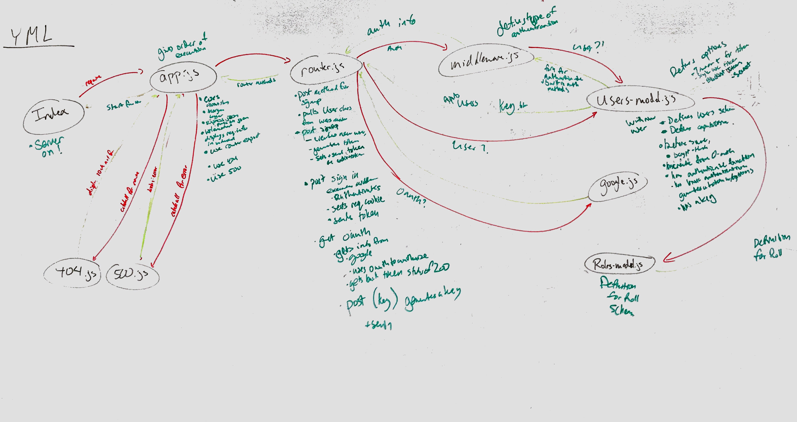

 LAB14
=================================================

## Access Control Lists

### Author: Aaron Ferris
Whiteboard completed with: Cory Henderson, Jon Gentry, Vanessa Wei

### Links and Resources
* [repo](http://xyz.com)
* [travis](http://xyz.com)
* [back-end](http://xyz.com) (when applicable)
* [front-end](http://xyz.com) (when applicable)

#### Documentation
* [swagger](http://xyz.com) (API assignments only)
* [jsdoc](http://xyz.com) (All assignments)

### Modified Modules
#### `router.js`

###### `get public-stuff`
anyone can access, brings back "you can read"

###### `get hidden-stuff`
someone with account can access, brings back "you are a part of the community"

###### `post something-to-read`
user can access, brings back "you can read"

###### `put create-a-thing`
someone with create can access, brings back "you can edit"

###### `patch update`
anyone can access, brings back "you can update"

###### `patch jp`
anyone can access, brings back "you can patch"

###### `delete bye-bye`
anyone can access, brings back "you can say bye-bye"

###### `get everything`
superuser can access, brings back "you can do anything"

###### `post roles`
save a new role to the database

#### `users.virtual.js`
extends users schema to combine with roles

### Setup
#### `.env` requirements
* in base run `npm i` to get all requirements
* create .env file
* setup access points in terminal
  * run `mongo` in base folder
  * in a second window run `nodemon` in base folder
  * in a third window, navigate to base folder run the following commands to ensure that it is working
    * `echo '{"username":"Aaron", "password":"FRISBEE"}' | http post :3000/signup`
      * signup modlue
    * `http post :3000/signin -a Aaron:FRISBEE`
      * signin module
    * `http post :3000/signin "Authorization:Bearer (insert_bearer_key_from_last_response)`
      * signin with the token

#### Running the app
* Create your user base classes
  * Running in node
    * `echo '{"role":"user", "capabilities":["read"]}' | http :3000/roles`
    * `echo '{"role":"editor", "capabilities":["create", "read", "update"]}' | http :3000/roles`
    * `echo '{"role":"admin", "capabilities":["create", "read", "update", "delete]}' | http :3000/roles`
    * `echo '{"role":"superuser", "capabilities":["create", "read", "update", "delete", "superuser"]}' | http :3000/roles`
  * you can verify in MongoDB Compass
* create your user accounts
  * running in node
    * `echo '{"username":"Aaron", "password":"FRISBEE", "role":"superuser"}' | http post :3000/signup`
  * you can verify in MongoDB Compass
* login
  * Running in node
    * `http post :3000/signin -a Aaron:FRISBEE`
* verify if they can log in to places with the appropriate credentials
  * Running in node
    * `http post :3000/create-a-thing "Authorization: Bearer (insert_bearer_key_from_last_response)"`
  * if it comes back with an error, either you are not logged in, you have not set the credentials correct, or you do not have the credentials on this particular account
#### Tests
* tests didn't have a chance

#### UML

